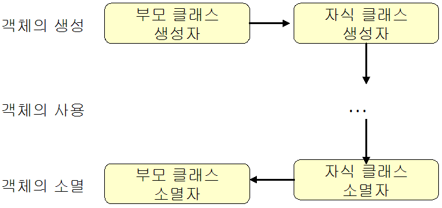

# 상속

## 1. 상속의 개요

**상속**: 이미 존재하는 클래스로부터 멤버들을 물려받는 것

**부모 클래스**: 이미 존재하는 클래스 (= 수퍼 클래스 = 기본 클래스)

**자식 클래스**: 상속을 받는 클래스 (= 서브 클래스 = 파생된 클래스)

자식 클래스는 부모 클래스가 가지고 있는 모든 멤버들을 모두 상속받고 자신이 필요한 멤버를 추가하기 때문에 항상 자식 클래스가 부모 클래스를 포함하게 됨

- **상속 형식**
    
    ```cpp
    class ChildClass **:** 접근지정자 ParentClass {
    ...
    }
    ```
    
- **상속의 장점**
    - 기존 클래스의 멤버 재사용
    - 기존 클래스 일부 변경 가능
    - 소프트웨어 개발 및 유지 보수에 유용
    - 중복되는 코드를 줄일 수 있음
- **상속에서 주의할 점**
    - 자식 클래스에서 추가된 멤버는 부모 클래스에 의해 사용될 수 없음
    - 상속은 is-a 관계임
        - 자동차는 탈것이다 / 사자, 개, 고양이는 동물이다와 같이 “~은 ~이다” is-a 관계가 성립한다면 상속으로 모델링하면 됨
        - 도서관은 책을 가지고 있다 / 거실은 소파를 가지고 있다와 같이 “~은 ~을 가지고 있다” has-a 관계가 성립한다면 상속으로 모델링하면 안 되고, 하나의 클래스 안에 다른 클래스의 객체를 포함시키면 됨
            
            ```cpp
            class Point {
            	int x;
            	int y;
            }
            class Line {
            	point p1; // Point 객체가 Line 클래스에 포함됨
            	point p2;
            }
            ```
            
- sports_car.cpp
    
    ```cpp
    #include <iostream>
    #include <string>
    using namespace std;
    
    class Car {
    public:
    	int speed;
    	int gear;
    	string color;
    
    	void setGear(int newGear) {
    		gear = newGear;
    	}
    	void speedUp(int increment) {
    		speed += increment;
    	}
    	void speedDown(int decrement) {
    		speed -= decrement;
    	}
    };
    
    // Car 클래스를 상속받는 SportsCar 클래스
    class SportsCar : public Car {
    	// 1개의 멤버 변수 추가
    	bool turbo;
    
    public:
    	// 1개의 멤버 함수 추가
    	void setTurbo(bool newValue) {
    		turbo = newValue;
    	}
    };
    ```
    

## 2. 접근 제어 지정자

상속이 도입되면 private, public에 더불어 **protected**라고 하는 접근 제어 지정자가 하나 더 필요함 → private으로 지정하면 자식 클래스에서도 접근할 수 없고, public으로 지정하면 정보 은닉이라는 객체 지향의 목표를 위반하는 것이 되므로 외부에서는 접근하지 못하지만 자식 클래스는 접근할 수 있도록 하는 새로운 접근 제어 지정자가 필요

| 접근 제어 지정자 | 현재 클래스 | 자식 클래스 | 클래스 외부 |
| --- | --- | --- | --- |
| private | O | X | X |
| protected | O | O | X |
| public | O | O | O |
- 자식 클래스가 부모 클래스로부터 상속받는 것: public, protected 멤버 (**private 멤버는 상속되지 않음**)
- manager.cpp
    
    ```cpp
    #include <iostream>
    #include <string>
    using namespace std;
    
    class Employee {
    	int rrn;
    
    protected:
    	int salary;
    
    public:
    	string name;
    	void setSalary(int salary);
    	int getSalary();
    };
    
    void Employee::setSalary(int salary) {
    	this->salary = salary;
    }
    
    int Employee::getSalary() {
    	return salary;
    }
    
    class Manager : public Employee {
    	// 멤버 변수 추가
    	int bonus;
    public:
    	// 멤버 함수 추가
    	Manager(int b = 0) : bonus(b) {} // 초기화 리스트 사용
    	void modify(int s, int b); // 수정
    	void display(); // 출력
    };
    
    void Manager::modify(int s, int b) {
    	salary = s; // 부모 클래스의 보호 멤버 사용 가능
    	bonus = b;
    }
    
    void Manager::display() {
    	cout << "봉급: " << salary << " 보너스: " << bonus << endl;
    	// cout << "주민등록번호: " << rrn << endl; // 부모 클래스의 전용 멤버는 사용할 수 없음
    }
    
    int main() {
    	Manager m;
    	m.setSalary(2000); // 부모 클래스의 멤버 함수 사용
    	m.display();
    	m.modify(1000, 500);
    	m.display();
    }
    ```
    

## 3. 상속과 생성자/소멸자

**자식 클래스의 객체가 생성될 때**는 자식 클래스 생성자보다 **부모 클래스 생성자가 먼저 묵시적으로 호출됨**



```cpp
#include <iostream>
#include <string>
using namespace std;

class Shape {
	int x, y;
public:
	Shape() {
		cout << "Shape 생성자()" << endl;
	}
	~Shape() {
		cout << "Shape 소멸자()" << endl;
	}
};

class Rectangle : public Shape {
	int width, height;
public:
	Rectangle() {
		cout << "Rectangle 생성자()" << endl;
	}
	~Rectangle() {
		cout << "Rectangle 소멸자()" << endl;
	}
};

int main() {
	Rectangle r;
	return 0;
}

Shape 생성자()
Rectangle 생성자()
Rectangle 소멸자()
Shape 소멸자()
```

- **부모 클래스 생성자의 명시적 호출**
    
    부모 클래스의 생성자를 지정하지 않으면 항상 디폴트 생성자(매개 변수가 없는 생성자)가 호출됨 → 자식 클래스의 생성자 헤더의 뒤에 콜론을 추가한 후 원하는 부모 클래스 생성자 작성
    
    ```cpp
    Rectangle(int x=0, int y=0, int w=0, int h=0) : Shape(x, y) {
    	width = w;
    	height = h;
    }
    ```
    
    ```cpp
    Rectangle(int x=0, int y=0, int w=0, int h=0) : Shape(x, y), width(w), height(h) {
    // 부모 클래스의 생성자 호출 다음에 멤버 초기화 리스트를 붙여도 됨
    }
    ```
    
    - inheri_shape2.cpp
        
        ```cpp
        #include <iostream>
        #include <string>
        using namespace std;
        
        class Shape {
        	int x, y;
        public:
        	Shape() {
        		cout << "Shape 생성자()" << endl;
        	}
        	Shape(int xloc, int yloc) : x(xloc), y(yloc) {
        		cout << "Shape 생성자(xloc, yloc)" << endl;
        	}
        	~Shape() {
        		cout << "Shape 소멸자()" << endl;
        	}
        };
        
        class Rectangle : public Shape {
        	int width, height;
        public:
        	Rectangle(int x = 0, int y = 0, int w = 0, int h = 0);
        	~Rectangle() {
        		cout << "Rectangle 소멸자()" << endl;
        	}
        };
        
        Rectangle::Rectangle(int x, int y, int w, int h) : Shape(x, y) {
        	width = w;
        	height = h;
        	cout << "Rectangle 생성자(x, y, w, h)" << endl;
        }
        
        int main() {
        	Rectangle r(0, 0, 100, 100);
        	return 0;
        }
        
        Shape 생성자(xloc, yloc)
        Rectangle 생성자(x, y, w, h)
        Rectangle 소멸자()
        Shape 소멸자()
        ```
        
    

## 4. 멤버의 재정의

**재정의(Overriding)**: 자식 클래스가 상속된 멤버 함수를 다시 정의하는 것

```cpp
#include <iostream>
#include <string>
using namespace std;

class Car {
public:
	int getHP() {
		return 100;
	}
}; 

class SportsCar : public Car {
public:
	int getHP() {
		return 300;
	}
};

int main() {
	SportsCar sc;
	cout << "마력: " << sc.getHP() << endl;
	// 자식 클래스인 sc를 통하여 접근하면 재정의된 함수에 우선권
	// 재정의된 getHP() 호출됨
	cout << "마력: " << sc.Car::getHP() << endl; // 범위 지정자를 사용하면 100이 출력됨
	return 0;
}
```

- **재정의 규칙**
    - 함수명 및 매개변수(타입 및 개수)까지 모두 일치
    - 함수의 반환 타입까지도 모두 일치
- **중복과 재정의의 차이**: 중복은 같은 이름의 멤버 함수를 여러 개 정의하는 것, 재정의는 부모 클래스에 있던 멤버 함수를 다시 정의해 내용을 변경하는 것
    - 자식 클래스에서 부모 클래스로부터 상속받은 멤버 함수를 오버로딩하면 자식 클래스의 새로운 멤버 함수로 간주됨
- **재정의된 멤버 함수의 호출 순서**: 상속 계층 구조에서 가장 낮은 위치의 멤버 함수부터 호출됨
- **부모 클래스의 멤버 함수 호출**
    - 보통 자식 클래스에서는 부모 클래스의 멤버 함수를 완전히 대치하는 경우보다 내용을 추가하는 경우가 많으므로, 자신이 필요한 부분을 작성한 다음, 범위 연산자인 ::을 이용해 부모 클래스의 멤버 함수를 호출해 주면 됨

## 5. 부모 클래스를 상속받는 3가지 방법

```cpp
class 자식 클래스 : public 부모 클래스 // public으로 상속
```

|  | public으로 상속 | protected로 상속 | private로 상속 |
| --- | --- | --- | --- |
| 부모 클래스의 public 멤버 | → public | → protected | → private |
| 부모 클래스의 protected 멤버 | → protected | → protected | → private |
| 부모 클래스의 private 멤버 | 접근 X | 접근 X | 접근 X |
- inheri_child2.cpp
    
    ```cpp
    #include <iostream>
    using namespace std;
    
    class ParentClass {
    public:
    	const static int x = 100;
    };
    
    class ChildClass1 : public ParentClass {
    };
    
    class ChildClass2 : private ParentClass {
    };
    
    int main() {
    	ChildClass1 obj1;
    	ChildClass2 obj2;
    	cout << obj1.x << endl; // ChildClass1에서는 x가 public으로 유지되므로 가능
    	cout << obj2.x << endl; // ChildClass2에서는 x가 private으로 변경되었으므로 불가능
    	return 0;
    }
    ```
    

## 6. 다중 상속

**다중 상속**: 하나의 자식 클래스가 두 개 이상의 부모 클래스로부터 멤버를 상속받는 것

```cpp
class Sub : public Sup1, public Sup2 {
...
}
```

- inheri_multi.cpp
    
    ```cpp
    #include <iostream>
    using namespace std;
    
    class PassangerCar {
    public:
    	int seats; // 정원
    	void set_seats(int n) {
    		seats = n;
    	}
    };
    
    class Truck {
    public:
    	int payload; // 적재 하중
    	void set_payload(int load) {
    		payload = load;
    	}
    };
    
    class Pickup : public PassangerCar, public Truck {
    public:
    	int tow_capability; // 견인 능력
    	void set_tow(int capa) {
    		tow_capability = capa;
    	}
    };
    
    int main() {
    	Pickup my_car;
    	my_car.set_seats(4); // PassangerCar 멤버 함수
    	my_car.set_payload(10000); // Truck 멤버 함수
    	my_car.set_tow(30000); // Pickup 멤버 함수
    	return 0;
    }
    ```
    
- **다중 상속의 문제점**
    
    ```cpp
    #include <iostream>
    using namespace std;
    
    class SuperA {
    public:
    	int x;
    	void sub() {
    		cout << "SuperA의 sub()" << endl;
    	}
    };
    class SuperB {
    public:
    	int x;
    	void sub() {
    		cout << "SuperB의 sub()" << endl;
    	}
    };
    
    class Sub : public SuperA, public SuperB {
    };
    
    int main() {
    	Sub obj;
    	obj.x = 10; // obj.x는 어떤 부모 클래스의 x를 참조하는가?
    	return 0;
    }
    ```
    
    위의 오류를 제거하려면 x의 앞에 범위 지정자 ::를 붙여야 함
    
    → 다중 상속은 상당히 이해하기 어렵고 미묘한 문제들을 발생시킬 수 있으므로 아주 주의할 것
    

## 7. 예제

- dog.cpp
    
    ```cpp
    #include <iostream>
    using namespace std;
    enum BREED { YORKIE, POODLE, BULLDOG }; // enum: 관련 있는 상수들의 집합
    
    class Animal {
    protected:
    	int age;
    	int weight;
    
    public:
    	// 생성자와 소멸자
    	Animal();
    	~Animal();
    
    	// 멤버 함수들
    	void speak() const;
    	void sleep() const;
    	void eat() const;
    };
    
    Animal::Animal() {
    	cout << "Animal 생성자" << endl;
    }
    
    Animal::~Animal() {
    	cout << "Animal 소멸자" << endl;
    }
    
    void Animal::speak() const {
    	cout << "Animal speak()" << endl;
    }
    
    void Animal::sleep() const {
    	cout << "Animal sleep" << endl;
    }
    
    void Animal::eat() const {
    	cout << "Animal eat()" << endl;
    }
    
    class Dog : public Animal {
    private:
    	BREED breed;
    public:
    	// 생성자와 소멸자
    	Dog();
    	~Dog();
    
    	// 멤버 함수들
    	void wag();
    	void bite();
    	void speak() const;
    };
    
    Dog::Dog() {
    	cout << "Dog 생성자" << endl;
    }
    
    Dog::~Dog() {
    	cout << "Dog 소멸자" << endl;
    }
    
    void Dog::wag() {
    	cout << "Dog wag()" << endl;
    }
    
    void Dog::bite() {
    	cout << "Dog bite()" << endl;
    }
    
    void Dog::speak() const {
    	cout << "Dog speak()" << endl;
    }
    
    int main() {
    	Dog dog;
    
    	dog.eat();
    	dog.sleep();
    	dog.speak();
    	dog.wag();
    
    	return 0;
    }
    ```
    
- inheri_employee2.cpp
    
    ```cpp
    #include <iostream>
    #include <string>
    using namespace std;
    
    class Person {
    	string name;
    	int age;
    	bool gender;
    public:
    	Person(string n = "", int a = 0, bool g = true) : name(n), age(a), gender(g) { }
    	void setName(string s) { name = s; }
    	string getName() const { return name; }
    	void setAge(int a) { age = a; }
    	int getAge() const { return age; }
    	void setGender(bool g) { gender = g; }
    	bool getGender() const { return gender; }
    };
    
    class Employee : public Person {
    	int number;
    	int salary;
    public:
    	// 명시적으로 Person의 생성자 호출
    	// 만약 매개 변수를 입력하지 않으면 괄호 안에서 초기화된 대로 설정됨
    	Employee(string n = "", int a = 0, bool g = true, int num = 0, int s = 0) : Person(n, a, g), number(num), salary(s) { }
    	void display() const;
    	void setNumber(int n) { number = n; }
    	int getNumber() const { return number; }
    	void setSalary(int s) { salary = s; }
    	int getSalary() const { return salary; }
    };
    
    void Employee::display() const {
    	cout << this->getName() << endl;
    	cout << this->getAge() << endl;
    	cout << this->getGender() << endl;
    	cout << this->getNumber() << endl;
    	cout << this->getSalary() << endl;
    }
    
    int main() {
    	Employee e("김철수", 26, true, 2010001, 2800);
    	e.display();
    	return 0;
    }
    ```